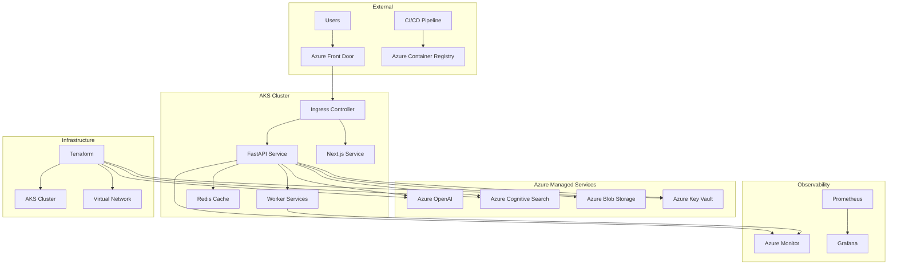

# Design Document

## Overview

The AKS Terraform Migration design transforms SageInsure from a traditional deployment model to a modern, cloud-native architecture using Azure Kubernetes Service (AKS) as the container orchestration platform, with all infrastructure managed through Terraform Infrastructure as Code (IaC). This design provides enhanced scalability, observability, security, and operational efficiency while maintaining the existing application functionality.

The architecture follows cloud-native principles with microservices patterns, leveraging managed Azure services for data persistence, AI/ML capabilities, and monitoring. The design emphasizes automation, security through managed identities, and GitOps practices for reliable deployments.

## Architecture

### High-Level Architecture



### Network Architecture

The network design implements a hub-and-spoke model with proper segmentation:

- **Virtual Network**: Dedicated VNet with multiple subnets for different tiers
- **AKS Subnet**: Private subnet for Kubernetes nodes with Network Security Groups
- **Application Gateway Subnet**: Public subnet for ingress (if using AGIC)
- **Private Endpoints**: Secure connectivity to Azure services without internet traversal
- **Network Policies**: Kubernetes-native traffic control between namespaces and pods

### Security Architecture

Security is implemented through multiple layers:

- **Identity**: Azure AD integration with Kubernetes RBAC
- **Secrets**: Azure Key Vault with CSI driver or Workload Identity
- **Network**: Private cluster option with NSGs and network policies
- **Images**: Container scanning in CI/CD with admission controllers
- **Runtime**: Pod Security Standards and OPA Gatekeeper policies

## Components and Interfaces

### Terraform Modules

The infrastructure is organized into modular Terraform components:

#### Core Infrastructure Modules

1. **backend.tf**

   - Azure Storage Account for Terraform state
   - Blob container with versioning and locking
   - Encryption at rest and in transit

2. **resource-group.tf**

   - Primary resource group for all components
   - Consistent naming and tagging strategy
   - RBAC assignments for service principals

3. **network.tf**

   - Virtual Network with calculated CIDR blocks
   - Subnets for AKS, Application Gateway, and private endpoints
   - Network Security Groups with minimal required rules
   - Route tables for custom routing if needed

4. **aks.tf**

   - AKS cluster with multiple node pools
   - System node pool for Kubernetes system components
   - General node pool for application workloads
   - GPU node pool for ML/AI workloads (optional)
   - Cluster autoscaler and pod autoscaler configuration

5. **identity.tf**

   - User Assigned Managed Identities for workloads
   - Service Principal for CI/CD operations
   - RBAC role assignments with least privilege
   - Workload Identity federation setup

6. **keyvault.tf**

   - Azure Key Vault with appropriate access policies
   - Secrets for OpenAI keys, connection strings
   - Certificate storage for TLS
   - Integration with AKS CSI driver

7. **azure-services.tf**
   - Azure OpenAI deployment and model configuration
   - Azure Cognitive Search service and indexes
   - Azure Storage Account for application data
   - Private endpoints for secure connectivity

#### Platform Add-ons Module

8. **platform-addons.tf**
   - Helm provider configuration
   - NGINX Ingress Controller or AGIC deployment
   - cert-manager for certificate automation
   - Prometheus Operator and Grafana
   - Azure Key Vault CSI driver

### Kubernetes Components

#### Application Services

1. **FastAPI Backend Service**

   - Deployment with configurable replicas
   - Service account with Workload Identity
   - ConfigMap for non-sensitive configuration
   - Secret mounts from Key Vault
   - Health check endpoints (/healthz, /readyz)
   - Resource requests and limits
   - Horizontal Pod Autoscaler (HPA)

2. **Worker Services**

   - Job-based workloads for batch processing
   - CronJob for scheduled indexing tasks
   - Queue-based processing with Redis or Azure Service Bus
   - Separate node pool targeting for resource optimization

3. **Next.js Frontend Service**
   - Deployment for static file serving
   - ConfigMap for runtime configuration
   - CDN integration through Azure Front Door

#### Infrastructure Services

1. **Ingress Configuration**

   - NGINX Ingress or AGIC with TLS termination
   - Path-based routing to different services
   - Rate limiting and security headers
   - Integration with cert-manager for automated certificates

2. **Monitoring Stack**
   - Prometheus for metrics collection
   - Grafana for visualization and dashboards
   - AlertManager for notification routing
   - Custom ServiceMonitor resources for application metrics

### External Service Interfaces

#### Azure OpenAI Integration

- REST API calls using Azure SDK
- Authentication via Managed Identity
- Connection pooling and retry logic
- Rate limiting and quota management

#### Azure Cognitive Search Integration

- Search index management and querying
- Document ingestion pipelines
- Vector search capabilities
- Authentication via Managed Identity

#### Azure Blob Storage Integration

- Document storage and retrieval
- Hierarchical namespace for organization
- Lifecycle management policies
- Access via Managed Identity

## Data Models

### Terraform State Management

```hcl
terraform {
  backend "azurerm" {
    resource_group_name  = "tfstate-rg"
    storage_account_name = "tfstate${random_id.suffix.hex}"
    container_name       = "terraform-state"
    key                  = "sageinsure/terraform.tfstate"
    use_msi             = true
  }
}
```

### Kubernetes Resource Definitions

#### Application Deployment Template

```yaml
apiVersion: apps/v1
kind: Deployment
metadata:
  name: sageinsure-api
  namespace: sageinsure
spec:
  replicas: 3
  selector:
    matchLabels:
      app: sageinsure-api
  template:
    metadata:
      labels:
        app: sageinsure-api
        azure.workload.identity/use: "true"
    spec:
      serviceAccountName: sageinsure-api-sa
      containers:
        - name: api
          image: ${ACR_NAME}.azurecr.io/sageinsure-api:${IMAGE_TAG}
          ports:
            - containerPort: 8000
          env:
            - name: AZURE_CLIENT_ID
              value: ${WORKLOAD_IDENTITY_CLIENT_ID}
          volumeMounts:
            - name: secrets-store
              mountPath: "/mnt/secrets"
              readOnly: true
          resources:
            requests:
              cpu: 100m
              memory: 256Mi
            limits:
              cpu: 500m
              memory: 512Mi
          readinessProbe:
            httpGet:
              path: /healthz
              port: 8000
            initialDelaySeconds: 5
            periodSeconds: 10
          livenessProbe:
            httpGet:
              path: /healthz
              port: 8000
            initialDelaySeconds: 20
            periodSeconds: 30
      volumes:
        - name: secrets-store
          csi:
            driver: secrets-store.csi.k8s.io
            readOnly: true
            volumeAttributes:
              secretProviderClass: "sageinsure-secrets"
```

### Configuration Management

#### Helm Values Structure

```yaml
# values.yaml
global:
  environment: production
  registry: ${ACR_NAME}.azurecr.io

api:
  image:
    repository: sageinsure-api
    tag: ${IMAGE_TAG}
  replicas: 3
  resources:
    requests:
      cpu: 100m
      memory: 256Mi
    limits:
      cpu: 500m
      memory: 512Mi

ingress:
  enabled: true
  className: nginx
  annotations:
    cert-manager.io/cluster-issuer: letsencrypt-prod
  hosts:
    - host: api.sageinsure.com
      paths:
        - path: /
          pathType: Prefix
  tls:
    - secretName: sageinsure-tls
      hosts:
        - api.sageinsure.com
```

## Error Handling

### Infrastructure Error Handling

1. **Terraform State Corruption**

   - Automated state backup before operations
   - State locking to prevent concurrent modifications
   - Recovery procedures documented in runbooks

2. **AKS Cluster Failures**

   - Multi-zone node pools for high availability
   - Cluster autoscaler for automatic node recovery
   - Pod disruption budgets to maintain service availability

3. **Network Connectivity Issues**
   - Health checks with appropriate timeouts
   - Circuit breaker patterns in application code
   - Retry logic with exponential backoff

### Application Error Handling

1. **Service Unavailability**

   - Kubernetes readiness and liveness probes
   - Service mesh (optional) for advanced traffic management
   - Graceful degradation when dependencies are unavailable

2. **Secret Access Failures**

   - Fallback mechanisms for secret retrieval
   - Monitoring and alerting on Key Vault access failures
   - Automated secret rotation with zero-downtime updates

3. **Resource Exhaustion**
   - Resource quotas and limits at namespace level
   - Horizontal and vertical pod autoscaling
   - Node pool autoscaling with appropriate limits

## Testing Strategy

### Infrastructure Testing

1. **Terraform Validation**

   - `terraform fmt`, `terraform validate` in CI/CD
   - `terraform plan` review process for changes
   - Automated testing with Terratest for complex modules

2. **Kubernetes Manifest Testing**

   - `helm lint` and `helm template` validation
   - Kubernetes manifest validation with kubeval
   - Policy testing with OPA/Gatekeeper dry-run mode

3. **Integration Testing**
   - End-to-end connectivity tests after deployment
   - Health check validation across all services
   - Load testing with realistic traffic patterns

### Application Testing

1. **Container Testing**

   - Security scanning with Trivy or similar tools
   - Vulnerability assessment in CI/CD pipeline
   - Runtime security monitoring with Falco

2. **Service Testing**

   - Unit tests for individual microservices
   - Integration tests for service-to-service communication
   - Contract testing for API compatibility

3. **Performance Testing**
   - Load testing with k6 or Locust
   - Chaos engineering with Chaos Monkey
   - Resource utilization monitoring under load

### Deployment Testing

1. **Blue-Green Deployments**

   - Parallel environment deployment
   - Traffic switching with validation
   - Automated rollback on failure detection

2. **Canary Deployments**

   - Gradual traffic shifting
   - Metrics-based promotion decisions
   - Automated rollback on error rate thresholds

3. **Disaster Recovery Testing**
   - Regular backup and restore procedures
   - Cross-region failover testing
   - RTO/RPO validation exercises
