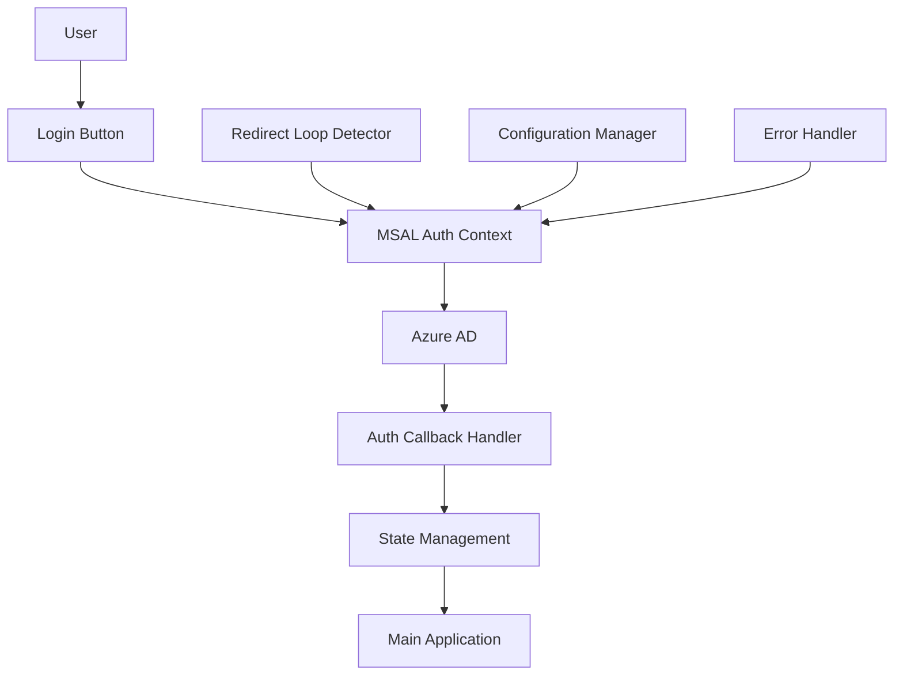

# Design Document

## Overview

The MSAL authentication loop issue is caused by several configuration and implementation problems in the current authentication system. The main issues are:

1. **Redirect Loop Detection**: The system lacks proper redirect loop detection and prevention
2. **State Management**: Authentication state is not properly managed during redirects
3. **Configuration Issues**: Production configuration may not be properly applied
4. **Callback Handling**: The callback handler may be causing additional redirects

This design addresses these issues by implementing proper redirect loop prevention, improving state management, and ensuring correct configuration handling.

## Architecture

The authentication system consists of several key components:



### Component Responsibilities

1. **MSAL Auth Context**: Manages authentication state and MSAL instance
2. **Auth Callback Handler**: Processes authentication responses from Azure AD
3. **Redirect Loop Detector**: Prevents infinite redirect loops
4. **Configuration Manager**: Ensures correct environment-specific configuration
5. **Error Handler**: Provides user-friendly error messages

## Components and Interfaces

### 1. Redirect Loop Prevention

**Purpose**: Detect and prevent infinite redirect loops during authentication.

**Implementation**:

- Track authentication attempts in session storage
- Implement maximum retry limits
- Clear authentication state when loop is detected
- Provide fallback error handling

```typescript
interface RedirectLoopDetector {
  trackAuthAttempt(): void;
  isLoopDetected(): boolean;
  clearTrackingData(): void;
  getAttemptCount(): number;
}
```

### 2. Enhanced Auth State Management

**Purpose**: Improve authentication state management to prevent inconsistent states.

**Implementation**:

- Use more granular state tracking
- Implement proper state transitions
- Add state validation
- Handle edge cases in state management

```typescript
interface AuthState {
  status:
    | "idle"
    | "authenticating"
    | "authenticated"
    | "error"
    | "loop_detected";
  user: UserProfile | null;
  error: string | null;
  attemptCount: number;
  lastAttemptTime: number;
}
```

### 3. Configuration Validation

**Purpose**: Ensure MSAL configuration is correct for the current environment.

**Implementation**:

- Validate all required configuration values
- Provide environment-specific defaults
- Add runtime configuration checks
- Implement configuration error reporting

```typescript
interface ConfigurationValidator {
  validateConfig(config: MSALConfiguration): ValidationResult;
  getEnvironmentConfig(): MSALConfiguration;
  reportConfigErrors(errors: string[]): void;
}
```

### 4. Improved Callback Handler

**Purpose**: Handle authentication callbacks more reliably without causing additional redirects.

**Implementation**:

- Add proper error handling in callback
- Implement timeout handling
- Prevent multiple callback processing
- Add callback state validation

```typescript
interface CallbackHandler {
  handleAuthCallback(): Promise<AuthResult>;
  validateCallbackState(): boolean;
  processAuthResponse(response: AuthResponse): void;
  handleCallbackError(error: Error): void;
}
```

## Data Models

### AuthState Model

```typescript
interface AuthState {
  status: AuthStatus;
  user: UserProfile | null;
  accessToken: string | null;
  error: AuthError | null;
  isLoading: boolean;
  attemptCount: number;
  lastAttemptTime: number;
  sessionId: string;
}

enum AuthStatus {
  IDLE = "idle",
  AUTHENTICATING = "authenticating",
  AUTHENTICATED = "authenticated",
  ERROR = "error",
  LOOP_DETECTED = "loop_detected",
}
```

### Configuration Model

```typescript
interface MSALConfigurationExtended extends Configuration {
  environment: "development" | "production";
  maxRedirectAttempts: number;
  redirectTimeoutMs: number;
  enableLoopDetection: boolean;
}
```

## Error Handling

### Error Types

1. **Configuration Errors**: Missing or invalid MSAL configuration
2. **Network Errors**: Connection issues during authentication
3. **Redirect Loop Errors**: Detected infinite redirect loops
4. **Token Errors**: Issues with token acquisition or validation
5. **Callback Errors**: Problems processing authentication callbacks

### Error Recovery Strategies

1. **Automatic Retry**: For transient network errors
2. **Fallback Configuration**: Use default values for missing config
3. **Loop Breaking**: Clear state and show error for redirect loops
4. **User Guidance**: Provide clear instructions for manual recovery

### Error Display

- User-friendly error messages
- Technical details for developers (in console)
- Recovery action suggestions
- Contact information for support

## Testing Strategy

### Unit Tests

- Test redirect loop detection logic
- Test configuration validation
- Test state management transitions
- Test error handling scenarios

### Integration Tests

- Test complete authentication flow
- Test callback handling
- Test error recovery
- Test environment-specific configuration

### End-to-End Tests

- Test user authentication journey
- Test redirect loop prevention
- Test error scenarios
- Test cross-browser compatibility

### Manual Testing

- Test in production environment
- Test with different user accounts
- Test network failure scenarios
- Test configuration edge cases

## Implementation Approach

### Phase 1: Redirect Loop Prevention

1. Implement redirect loop detection
2. Add attempt tracking
3. Add loop breaking logic
4. Test loop prevention

### Phase 2: State Management Improvements

1. Enhance auth state model
2. Improve state transitions
3. Add state validation
4. Test state management

### Phase 3: Configuration Validation

1. Add configuration validation
2. Implement environment detection
3. Add error reporting
4. Test configuration handling

### Phase 4: Callback Handler Improvements

1. Enhance callback processing
2. Add timeout handling
3. Improve error handling
4. Test callback scenarios

### Phase 5: Integration and Testing

1. Integrate all components
2. Comprehensive testing
3. Production deployment
4. Monitoring and validation
