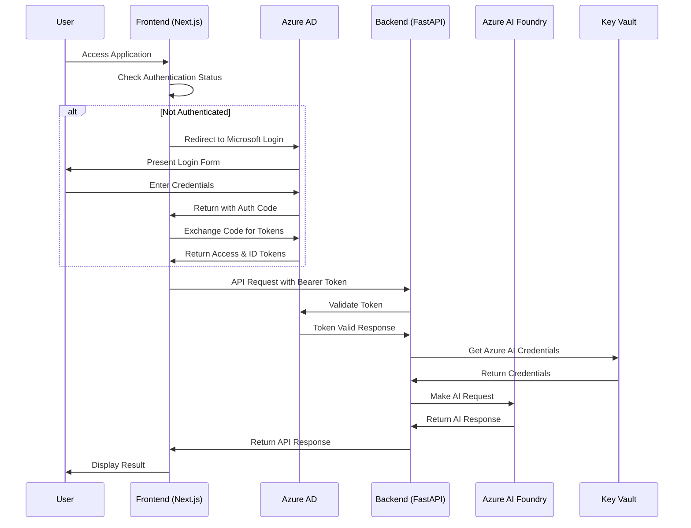
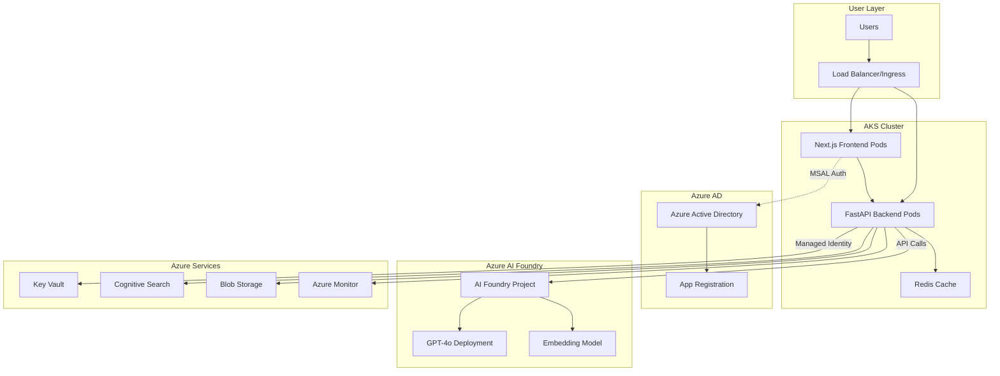

# Design Document

## Overview

The MSAL Azure AI Integration design transforms the existing SageInsure application from development mode authentication to production-ready Microsoft Authentication Library (MSAL) integration. This design leverages the existing Azure AI Foundry resources (maplesage-openai-project, parvinddutta-9607_ai) and implements secure authentication flows that integrate seamlessly with Azure Kubernetes Service (AKS) deployment.

The architecture maintains the existing FastAPI backend and Next.js frontend while adding robust authentication, proper Azure service integration, and production-ready deployment configurations. The design emphasizes security, scalability, and seamless user experience across development, staging, and production environments.

## Architecture

### High-Level Authentication Flow



### System Architecture



## Components and Interfaces

### Frontend Authentication Components

#### 1. MSAL Configuration Module

**File: `lib/msal-config.ts`**

```typescript
import { Configuration, LogLevel } from "@azure/msal-browser";

const isProduction = process.env.NODE_ENV === "production";
const isDevelopment = process.env.NEXT_PUBLIC_DEVELOPMENT_MODE === "true";

export const msalConfig: Configuration = {
  auth: {
    clientId: process.env.NEXT_PUBLIC_AZURE_CLIENT_ID!,
    authority: `https://login.microsoftonline.com/${process.env.NEXT_PUBLIC_AZURE_TENANT_ID}`,
    redirectUri: isProduction
      ? process.env.NEXT_PUBLIC_REDIRECT_URI_PROD
      : process.env.NEXT_PUBLIC_REDIRECT_URI,
    postLogoutRedirectUri: isProduction
      ? process.env.NEXT_PUBLIC_REDIRECT_URI_PROD
      : process.env.NEXT_PUBLIC_REDIRECT_URI,
  },
  cache: {
    cacheLocation: "sessionStorage",
    storeAuthStateInCookie: false,
  },
  system: {
    loggerOptions: {
      loggerCallback: (level, message, containsPii) => {
        if (containsPii) return;
        console.log(message);
      },
      logLevel: isDevelopment ? LogLevel.Verbose : LogLevel.Error,
    },
  },
};

export const loginRequest = {
  scopes: ["openid", "profile", "User.Read"],
};

export const apiRequest = {
  scopes: [`api://${process.env.NEXT_PUBLIC_AZURE_CLIENT_ID}/access_as_user`],
};
```

#### 2. Enhanced Authentication Context

**File: `lib/auth-context.tsx`**

```typescript
import React, { createContext, useContext, useEffect, useState } from 'react';
import {
  PublicClientApplication,
  AccountInfo,
  AuthenticationResult,
  InteractionRequiredAuthError
} from '@azure/msal-browser';
import { MsalProvider, useMsal, useAccount } from '@azure/msal-react';
import { msalConfig, loginRequest, apiRequest } from './msal-config';

const msalInstance = new PublicClientApplication(msalConfig);

interface AuthContextType {
  isAuthenticated: boolean;
  user: AccountInfo | null;
  accessToken: string | null;
  signIn: () => Promise<void>;
  signOut: () => Promise<void>;
  getAccessToken: () => Promise<string | null>;
  isLoading: boolean;
  error: string | null;
}

const AuthContext = createContext<AuthContextType>({
  isAuthenticated: false,
  user: null,
  accessToken: null,
  signIn: async () => {},
  signOut: async () => {},
  getAccessToken: async () => null,
  isLoading: true,
  error: null,
});

function AuthProviderInner({ children }: { children: React.ReactNode }) {
  const { instance, accounts } = useMsal();
  const account = useAccount(accounts[0] || {});

  const [isLoading, setIsLoading] = useState(true);
  const [accessToken, setAccessToken] = useState<string | null>(null);
  const [error, setError] = useState<string | null>(null);

  useEffect(() => {
    const initializeAuth = async () => {
      try {
        await instance.initialize();
        const accounts = instance.getAllAccounts();
        if (accounts.length > 0) {
          instance.setActiveAccount(accounts[0]);
          await getAccessToken();
        }
      } catch (error) {
        console.error('Auth initialization failed:', error);
        setError('Authentication initialization failed');
      } finally {
        setIsLoading(false);
      }
    };

    initializeAuth();
  }, [instance]);

  const signIn = async () => {
    try {
      setIsLoading(true);
      setError(null);
      const response = await instance.loginPopup(loginRequest);
      instance.setActiveAccount(response.account);
      await getAccessToken();
    } catch (error) {
      console.error('Sign in failed:', error);
      setError('Sign in failed. Please try again.');
    } finally {
      setIsLoading(false);
    }
  };

  const signOut = async () => {
    try {
      setAccessToken(null);
      await instance.logoutPopup();
    } catch (error) {
      console.error('Sign out failed:', error);
    }
  };

  const getAccessToken = async (): Promise<string | null> => {
    if (!account) return null;

    try {
      const response = await instance.acquireTokenSilent({
        ...apiRequest,
        account: account,
      });
      setAccessToken(response.accessToken);
      return response.accessToken;
    } catch (error) {
      if (error instanceof InteractionRequiredAuthError) {
        try {
          const response = await instance.acquireTokenPopup({
            ...apiRequest,
            account: account,
          });
          setAccessToken(response.accessToken);
          return response.accessToken;
        } catch (popupError) {
          console.error('Token acquisition failed:', popupError);
          setError('Failed to acquire access token');
          return null;
        }
      }
      console.error('Token acquisition failed:', error);
      return null;
    }
  };

  const value = {
    isAuthenticated: !!account,
    user: account,
    accessToken,
    signIn,
    signOut,
    getAccessToken,
    isLoading,
    error,
  };

  return (
    <AuthContext.Provider value={value}>
      {children}
    </AuthContext.Provider>
  );
}

export function AuthProvider({ children }: { children: React.ReactNode }) {
  return (
    <MsalProvider instance={msalInstance}>
      <AuthProviderInner>{children}</AuthProviderInner>
    </MsalProvider>
  );
}

export const useAuth = () => useContext(AuthContext);
```

#### 3. API Client with Authentication

**File: `lib/api-client.ts`**

```typescript
import axios, { AxiosInstance, AxiosRequestConfig } from "axios";
import { useAuth } from "./auth-context";

class ApiClient {
  private client: AxiosInstance;
  private getAccessToken: () => Promise<string | null>;

  constructor(baseURL: string, getAccessToken: () => Promise<string | null>) {
    this.getAccessToken = getAccessToken;
    this.client = axios.create({
      baseURL,
      timeout: 30000,
    });

    this.setupInterceptors();
  }

  private setupInterceptors() {
    this.client.interceptors.request.use(async (config) => {
      const token = await this.getAccessToken();
      if (token) {
        config.headers.Authorization = `Bearer ${token}`;
      }
      return config;
    });

    this.client.interceptors.response.use(
      (response) => response,
      (error) => {
        if (error.response?.status === 401) {
          // Token expired or invalid - trigger re-authentication
          window.location.href = "/login";
        }
        return Promise.reject(error);
      }
    );
  }

  async post(url: string, data?: any, config?: AxiosRequestConfig) {
    return this.client.post(url, data, config);
  }

  async get(url: string, config?: AxiosRequestConfig) {
    return this.client.get(url, config);
  }
}

export const useApiClient = () => {
  const { getAccessToken } = useAuth();
  const baseURL = process.env.NEXT_PUBLIC_API_URL || "http://localhost:8000";

  return new ApiClient(baseURL, getAccessToken);
};
```

### Backend Authentication Components

#### 1. MSAL Token Validation Middleware

**File: `auth/msal_validator.py`**

```python
import jwt
import requests
from fastapi import HTTPException, Depends
from fastapi.security import HTTPBearer, HTTPAuthorizationCredentials
from functools import lru_cache
import os
from typing import Dict, Optional
import logging

logger = logging.getLogger(__name__)

security = HTTPBearer()

class MSALTokenValidator:
    def __init__(self):
        self.tenant_id = os.getenv('AZURE_TENANT_ID')
        self.client_id = os.getenv('AZURE_CLIENT_ID')
        self.jwks_uri = f"https://login.microsoftonline.com/{self.tenant_id}/discovery/v2.0/keys"

    @lru_cache(maxsize=10)
    def get_signing_keys(self) -> Dict:
        """Cache JWKS keys for token validation"""
        try:
            response = requests.get(self.jwks_uri, timeout=10)
            response.raise_for_status()
            return response.json()
        except Exception as e:
            logger.error(f"Failed to fetch JWKS: {e}")
            raise HTTPException(status_code=500, detail="Authentication service unavailable")

    def validate_token(self, token: str) -> Dict:
        """Validate MSAL token and return user claims"""
        try:
            # Decode header to get key ID
            unverified_header = jwt.get_unverified_header(token)
            kid = unverified_header.get('kid')

            # Get signing key
            jwks = self.get_signing_keys()
            signing_key = None

            for key in jwks['keys']:
                if key['kid'] == kid:
                    signing_key = jwt.algorithms.RSAAlgorithm.from_jwk(key)
                    break

            if not signing_key:
                raise HTTPException(status_code=401, detail="Invalid token signature")

            # Validate token
            payload = jwt.decode(
                token,
                signing_key,
                algorithms=['RS256'],
                audience=self.client_id,
                issuer=f"https://login.microsoftonline.com/{self.tenant_id}/v2.0"
            )

            return payload

        except jwt.ExpiredSignatureError:
            raise HTTPException(status_code=401, detail="Token has expired")
        except jwt.InvalidTokenError as e:
            logger.error(f"Token validation failed: {e}")
            raise HTTPException(status_code=401, detail="Invalid token")

validator = MSALTokenValidator()

async def get_current_user(credentials: HTTPAuthorizationCredentials = Depends(security)) -> Dict:
    """Dependency to get current authenticated user"""
    if not credentials:
        raise HTTPException(status_code=401, detail="Authentication required")

    return validator.validate_token(credentials.credentials)

async def optional_auth(credentials: Optional[HTTPAuthorizationCredentials] = Depends(security)) -> Optional[Dict]:
    """Optional authentication for endpoints that work with or without auth"""
    if not credentials:
        return None

    try:
        return validator.validate_token(credentials.credentials)
    except HTTPException:
        return None
```

#### 2. Azure AI Service Integration

**File: `services/azure_ai_service.py`**

```python
import openai
import os
from azure.identity import DefaultAzureCredential, ManagedIdentityCredential
from azure.keyvault.secrets import SecretClient
from typing import Dict, List, Optional
import logging

logger = logging.getLogger(__name__)

class AzureAIService:
    def __init__(self):
        self.setup_credentials()
        self.setup_openai_client()

    def setup_credentials(self):
        """Setup Azure credentials using Managed Identity in production"""
        if os.getenv('ENVIRONMENT') == 'production':
            self.credential = ManagedIdentityCredential()
        else:
            self.credential = DefaultAzureCredential()

        # Setup Key Vault client
        vault_url = os.getenv('AZURE_KEY_VAULT_URL', 'https://kv-sageretailjssso.vault.azure.net/')
        self.secret_client = SecretClient(vault_url=vault_url, credential=self.credential)

    def setup_openai_client(self):
        """Configure OpenAI client for Azure AI Foundry"""
        try:
            # Get OpenAI credentials from Key Vault
            openai_key = self.get_secret('azure-openai-key')
            openai_endpoint = self.get_secret('azure-openai-endpoint') or os.getenv('AZURE_OPENAI_ENDPOINT')

            openai.api_type = "azure"
            openai.api_base = openai_endpoint
            openai.api_key = openai_key
            openai.api_version = "2024-02-15-preview"

            logger.info("Azure OpenAI client configured successfully")

        except Exception as e:
            logger.error(f"Failed to configure OpenAI client: {e}")
            # Fallback to environment variables
            openai.api_type = "azure"
            openai.api_base = os.getenv('AZURE_OPENAI_ENDPOINT')
            openai.api_key = os.getenv('AZURE_OPENAI_API_KEY')
            openai.api_version = "2024-02-15-preview"

    def get_secret(self, secret_name: str) -> Optional[str]:
        """Get secret from Azure Key Vault"""
        try:
            secret = self.secret_client.get_secret(secret_name)
            return secret.value
        except Exception as e:
            logger.warning(f"Failed to get secret {secret_name}: {e}")
            return None

    async def chat_completion(
        self,
        messages: List[Dict],
        user_context: Optional[Dict] = None,
        deployment: str = "gpt-4o"
    ) -> Dict:
        """Generate chat completion with user context for auditing"""
        try:
            # Add user context for auditing if available
            if user_context:
                logger.info(f"AI request from user: {user_context.get('preferred_username', 'unknown')}")

            response = openai.ChatCompletion.create(
                engine=deployment,
                messages=messages,
                temperature=0.7,
                max_tokens=800,
                top_p=0.9,
                user=user_context.get('oid') if user_context else None  # User ID for tracking
            )

            return {
                'response': response.choices[0].message.content,
                'usage': response.usage,
                'model': deployment
            }

        except Exception as e:
            logger.error(f"OpenAI API error: {e}")
            raise Exception(f"AI service unavailable: {str(e)}")

# Global service instance
azure_ai_service = AzureAIService()
```

#### 3. Updated FastAPI Application

**File: `app.py` (Updated)**

```python
from fastapi import FastAPI, HTTPException, Depends
from fastapi.middleware.cors import CORSMiddleware
from pydantic import BaseModel
import os
from datetime import datetime
from typing import List, Optional, Dict
from auth.msal_validator import get_current_user, optional_auth
from services.azure_ai_service import azure_ai_service

app = FastAPI(
    title="SageInsure AI API",
    version="3.0.0",
    description="MSAL-authenticated AI-powered insurance assistant"
)

# CORS middleware with production origins
allowed_origins = os.getenv('CORS_ORIGINS', 'http://localhost:3000').split(',')
app.add_middleware(
    CORSMiddleware,
    allow_origins=allowed_origins,
    allow_credentials=True,
    allow_methods=["*"],
    allow_headers=["*"],
)

class ChatRequest(BaseModel):
    text: str
    conversationId: str = "session"
    specialist: str = "GENERAL"
    context: List[dict] = []

class ChatResponse(BaseModel):
    response: str
    agent: str
    specialist: str
    confidence: float
    status: str
    conversationId: str
    timestamp: str
    user: Optional[str] = None

@app.get("/")
async def health_check():
    return {
        "status": "SageInsure AI API Running",
        "version": "3.0.0",
        "timestamp": datetime.now().isoformat(),
        "authentication": "MSAL Enabled",
        "azure_ai": "Foundry Integrated"
    }

@app.get("/auth/status")
async def auth_status(user: Dict = Depends(get_current_user)):
    """Get current user authentication status"""
    return {
        "authenticated": True,
        "user": {
            "name": user.get('name'),
            "email": user.get('preferred_username'),
            "tenant": user.get('tid')
        },
        "timestamp": datetime.now().isoformat()
    }

@app.post("/chat")
async def chat_endpoint(
    request: ChatRequest,
    user: Optional[Dict] = Depends(optional_auth)
):
    """AI-powered chat endpoint with optional authentication"""

    try:
        # Build messages for AI
        messages = [
            {"role": "system", "content": get_specialist_prompt(request.specialist)},
            {"role": "user", "content": request.text}
        ]

        # Add conversation context
        if request.context:
            for ctx in request.context[-3:]:
                if ctx.get("role") and ctx.get("content"):
                    messages.insert(-1, {"role": ctx["role"], "content": ctx["content"]})

        # Call Azure AI service
        ai_response = await azure_ai_service.chat_completion(
            messages=messages,
            user_context=user
        )

        return ChatResponse(
            response=ai_response['response'],
            agent=f"SageInsure AI {request.specialist.replace('_', ' ').title()}",
            specialist=request.specialist,
            confidence=0.95,
            status="success",
            conversationId=request.conversationId,
            timestamp=datetime.now().isoformat(),
            user=user.get('preferred_username') if user else None
        )

    except Exception as e:
        logger.error(f"Chat endpoint error: {e}")
        raise HTTPException(status_code=500, detail="AI service temporarily unavailable")

def get_specialist_prompt(specialist: str) -> str:
    """Get system prompt for specialist"""
    prompts = {
        "CLAIMS_MANAGER": "You are a Claims Manager AI for SageInsure...",
        "POLICY_ASSISTANT": "You are a Policy Assistant AI for SageInsure...",
        # ... other prompts
    }
    return prompts.get(specialist, "You are a helpful insurance AI assistant for SageInsure.")

if __name__ == "__main__":
    import uvicorn
    uvicorn.run(app, host="0.0.0.0", port=8000)
```

## Data Models

### Environment Configuration

#### Development Environment

```bash
# Frontend (.env.local)
NEXT_PUBLIC_AZURE_CLIENT_ID=dev-client-id-guid
NEXT_PUBLIC_AZURE_TENANT_ID=common
NEXT_PUBLIC_REDIRECT_URI=http://localhost:3000/auth/callback
NEXT_PUBLIC_API_URL=http://localhost:8000
NEXT_PUBLIC_DEVELOPMENT_MODE=false

# Backend (.env)
AZURE_TENANT_ID=your-tenant-id
AZURE_CLIENT_ID=dev-client-id-guid
AZURE_KEY_VAULT_URL=https://kv-sageretailjssso.vault.azure.net/
ENVIRONMENT=development
```

#### Production Environment (Kubernetes Secrets)

```yaml
apiVersion: v1
kind: Secret
metadata:
  name: msal-config
  namespace: sageinsure
type: Opaque
stringData:
  AZURE_TENANT_ID: "your-production-tenant-id"
  AZURE_CLIENT_ID: "your-production-client-id"
  AZURE_KEY_VAULT_URL: "https://kv-sageretailjssso.vault.azure.net/"
  ENVIRONMENT: "production"
```

### Azure AD App Registration Configuration

```json
{
  "appId": "your-client-id-guid",
  "displayName": "SageInsure Application",
  "signInAudience": "AzureADMyOrg",
  "web": {
    "redirectUris": [
      "http://localhost:3000/auth/callback",
      "https://sageinsure.com/auth/callback",
      "https://staging.sageinsure.com/auth/callback"
    ],
    "logoutUrl": "https://sageinsure.com/logout"
  },
  "spa": {
    "redirectUris": [
      "http://localhost:3000/auth/callback",
      "https://sageinsure.com/auth/callback"
    ]
  },
  "requiredResourceAccess": [
    {
      "resourceAppId": "00000003-0000-0000-c000-000000000000",
      "resourceAccess": [
        {
          "id": "e1fe6dd8-ba31-4d61-89e7-88639da4683d",
          "type": "Scope"
        }
      ]
    }
  ]
}
```

## Error Handling

### Frontend Error Handling

1. **Authentication Errors**

   - Token expiration: Automatic silent refresh
   - Network errors: Retry with exponential backoff
   - User cancellation: Graceful fallback to login prompt

2. **API Communication Errors**
   - 401 Unauthorized: Redirect to login
   - 403 Forbidden: Display access denied message
   - 500 Server Error: Display retry option

### Backend Error Handling

1. **Token Validation Errors**

   - Invalid signature: Return 401 with clear message
   - Expired token: Return 401 with refresh instruction
   - Missing token: Return 401 with authentication required

2. **Azure Service Errors**
   - Key Vault access: Fallback to environment variables
   - OpenAI API errors: Return graceful error message
   - Network timeouts: Implement retry logic

## Testing Strategy

### Authentication Testing

1. **Unit Tests**

   - MSAL configuration validation
   - Token validation logic
   - Error handling scenarios

2. **Integration Tests**

   - End-to-end authentication flow
   - API authentication middleware
   - Azure service integration

3. **Security Testing**
   - Token manipulation attempts
   - CORS policy validation
   - SSL/TLS configuration

### Deployment Testing

1. **Environment Testing**

   - Development environment setup
   - Staging environment validation
   - Production deployment verification

2. **Performance Testing**

   - Authentication flow performance
   - API response times with auth
   - Concurrent user authentication

3. **Monitoring and Alerting**
   - Authentication failure rates
   - Token refresh patterns
   - Azure service health checks
